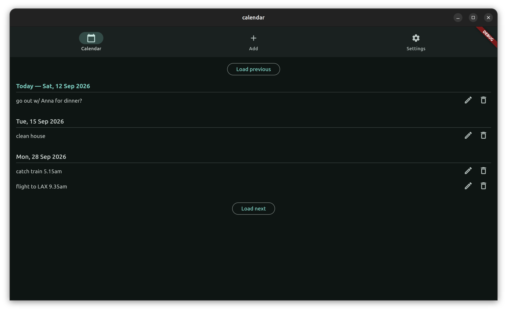

# calendar



A minimal Flutter calendar. One entry per `.json` file in a folder you pick;
an entry is just a **date** and a line of **text** — no times, nothing else.
Targets Linux desktop and Android (sideload) only.

## Prerequisites

- [Flutter SDK](https://docs.flutter.dev/install) (stable channel)
- Android SDK + NDK (via `flutter doctor` / Android Studio) for the Android target
- Linux desktop build tools:
  - Ubuntu: `sudo apt install cmake ninja-build clang libgtk-3-dev imagemagick`
  - Fedora: `sudo dnf install cmake ninja-build clang gtk3-devel ImageMagick`
- [`just`](https://github.com/casey/just) (optional) — see `justfile` for the dev/build/install shortcuts used below

## Setup

```bash
flutter pub get
```

## Development

```bash
just dev                # or: flutter run -d linux
flutter run -d <device> # Android device/emulator
```

On first launch the app opens straight into Settings and asks you to pick a data
folder — nothing is hardcoded. The whole folder is parsed into memory once, in a
background isolate (`compute`), then the app works entirely off that in-memory
copy for the rest of the session (it assumes nothing else edits the folder
concurrently).

- **Android**: on launch the app requests "All files access"
  (`MANAGE_EXTERNAL_STORAGE`) so it can read/write a folder anywhere on the
  device. This is a manual one-time toggle in system Settings; a "Grant full
  disk access" button is also on the Settings tab if it was skipped or revoked.
- **Linux**: a native folder picker (`file_picker`), backed by a real filesystem path.

The chosen folder path is persisted via `shared_preferences` (`data_folder` key)
and reused on next launch.

## Build

```bash
just apk                    # debug APK, drops you into its output dir
just reinstall              # release Linux bundle, installed to ~/.local + desktop entry
flutter build apk --debug   # equivalent, manual
flutter build linux         # equivalent, manual
```

Install a built APK: `adb install -r build/app/outputs/flutter-apk/app-debug.apk`

## Icon

`icons/` holds the source bundle (a favicon-generator export of the Twemoji
calendar glyph — attribution in `icons/about.txt`); `icons/android-chrome-512x512.png`
is the master. Nothing in the Flutter build reads `icons/` — the per-target
files are committed and regenerated by hand after changing the master:

```bash
# Android launcher icons
for ds in mdpi:48 hdpi:72 xhdpi:96 xxhdpi:144 xxxhdpi:192; do
  d=${ds%%:*}; s=${ds##*:}
  magick icons/android-chrome-512x512.png -resize "${s}x${s}" \
    "android/app/src/main/res/mipmap-$d/ic_launcher.png"
done

# Web icons (only if you build web)
magick icons/android-chrome-512x512.png -resize 512x512 web/icons/Icon-512.png
magick icons/android-chrome-512x512.png -resize 192x192 web/icons/Icon-192.png
magick icons/android-chrome-512x512.png -resize 512x512 web/icons/Icon-maskable-512.png
magick icons/android-chrome-512x512.png -resize 192x192 web/icons/Icon-maskable-192.png
magick icons/android-chrome-512x512.png -resize 32x32   web/favicon.png
```

Linux needs nothing committed: `just reinstall` regenerates the hicolor icon
theme set from `icons/android-chrome-512x512.png` at install time and points the
desktop entry's `Icon=` at it.

## Analysis

```bash
flutter analyze
```

## Data format

Each entry is one `*.json` file directly inside the data folder, a single JSON
object with exactly two keys:

```json
{
  "date": "2026-08-29",
  "content": "the entry's text"
}
```

- `date` is `YYYY-MM-DD` — a calendar day, no time component.
- `content` is a plain-text line, shown exactly as typed — no markdown rendering.
- A missing/invalid `date` falls back to today; a missing `content` to empty.
- Writes go through a temp file + atomic rename, so a crash mid-write can't
  leave a half-written file.
- The filename (`<date>-<6 hex chars>.json`) is only an id — the `date` field is
  the source of truth, so editing an entry's date rewrites the file in place
  without renaming it.

See `lib/models/entry.dart` for the read/write logic and
`lib/repository/entry_repository.dart` for the folder scan + in-memory store.

## Screens

- **Calendar** — every entry grouped under its day. Today's heading is always
  shown (even with no entries); any other day appears only when it has one.
  Each entry row has an "Edit" icon button (jumps to the Add form, prefilled)
  and a "Delete" icon button (confirms, then removes the file).
- **Add** — a date button (opens a date picker, defaults to today) and a text
  field. "Add" writes a new `.json` file and clears the field for the next one.
- **Settings** — shows the current data folder and loaded entry count, lets you
  pick a different folder, and (Android only) lets you (re-)grant full disk access.
